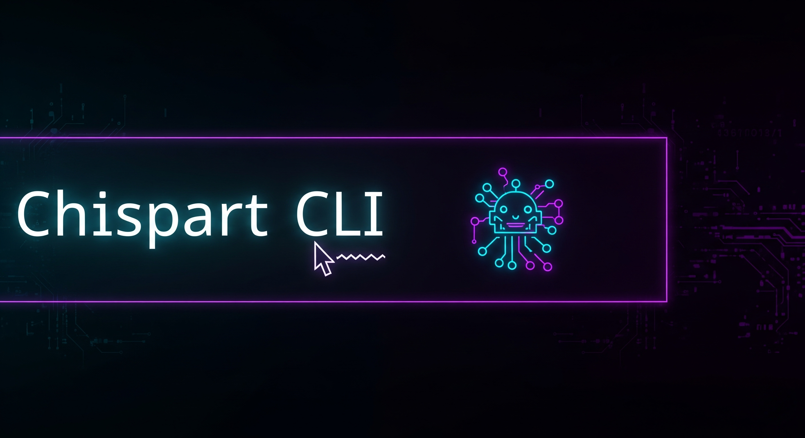

# 📚 Documentación Técnica – Chispart CLI

<p align="center">
  
</p>

Este documento describe el funcionamiento interno de **Chispart CLI**, la configuración necesaria y cómo interactúa con **Gemini API** y **ProjectAura (GPT)**.

---

## 🔥 Arquitectura de Comunicación

```
Usuario → Chispart CLI → Gemini API → Scripts / Lógica  
                                   ↳ (cuando es necesario) → ProjectAura → Modelo GPT → Respuesta enriquecida
```

- **Gemini API**: Procesa lenguaje natural y clasifica intenciones.  
- **ProjectAura**: Conector que interactúa con modelos GPT para razonamiento avanzado.  
- **Chispart CLI**: Orquestador que entrega la respuesta final al usuario.

---

## ⚙️ Componentes Principales

- **`chispart.js`** – Punto de entrada; envía consultas a Gemini API y decide si delegar a GPT.  
- **`projectaura.js`** – Conector Node.js que se comunica con el endpoint GPT (OpenAI u otro compatible).  
- **`ask-projectaura.sh`** – Wrapper que prepara las consultas para ProjectAura.  
- **`brain/intent-mapping.json`** – Define intenciones, palabras clave y scripts a ejecutar.  
- **`actions/*.sh`** – Scripts de automatización ejecutados según la intención detectada.

---

## 🔐 Configuración de Claves API

Para habilitar la comunicación con GPT a través de ProjectAura:

1. Obtén una clave de API de OpenAI u otro proveedor GPT.  
2. Configura una variable de entorno:  

```bash
export PROJECTAURA_API_KEY="tu_clave_aqui"
```

3. (Opcional) Define el endpoint del modelo:  

```bash
export PROJECTAURA_ENDPOINT="https://api.openai.com/v1/chat/completions"
```

---

## 🚦 Flujo de Ejecución

1. El usuario escribe un comando natural:  
   ```bash
   chispart analiza logs del sistema
   ```
2. `chispart.js` envía la entrada a **Gemini API**, que detecta la intención "análisis de logs".  
3. Si se requiere IA avanzada, llama a **ProjectAura**, que envía la consulta a **GPT**.  
4. GPT devuelve un análisis enriquecido que Chispart CLI presenta al usuario.

---

## 🛠️ Ejemplos de Uso Avanzado

### ✅ Ejemplo 1: Consulta directa a GPT vía ProjectAura
```bash
chispart consulta projectaura sobre optimización de rendimiento en React
```

### ✅ Ejemplo 2: Automatización con IA
```bash
chispart genera script de backup optimizado
```

Gemini interpreta el comando, genera contexto y ProjectAura (GPT) sugiere el script adecuado.

---

## 🧩 Casos de Integración

- **Desarrollo:** asistencia con código, refactorización y generación de scripts.  
- **DevOps:** despliegues automatizados con recomendaciones inteligentes.  
- **Data Analysis:** análisis avanzado de logs, métricas y sugerencias.

---

## 📌 Notas Finales

- Chispart CLI usa Gemini API como cerebro principal y GPT como cerebro auxiliar.  
- Puedes cambiar el modelo de ProjectAura (por ejemplo, GPT-4, local LLM, etc.) sin alterar el flujo de Chispart.  
- Diseño modular: es fácil agregar nuevas intenciones y scripts.

---

🚀 **Con Chispart CLI obtienes una terminal con inteligencia híbrida (Gemini + GPT).**
